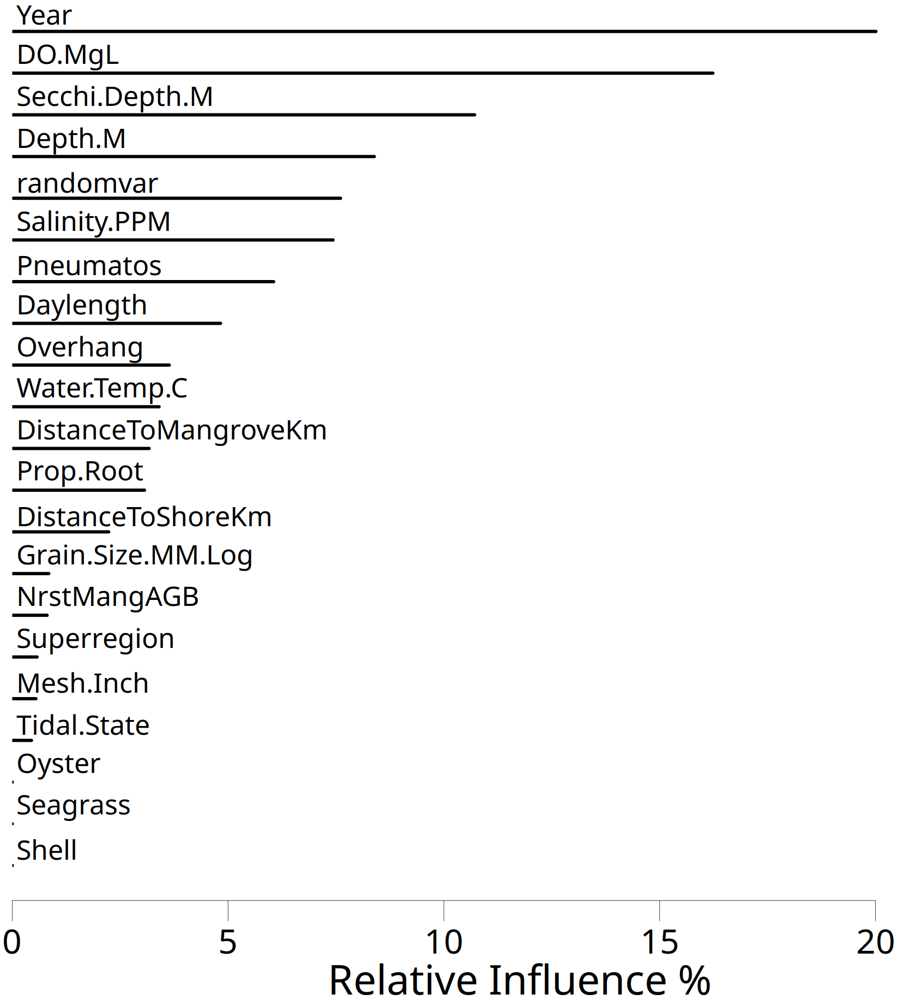
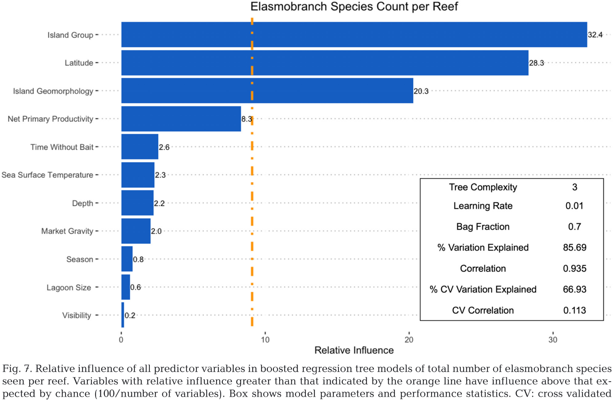
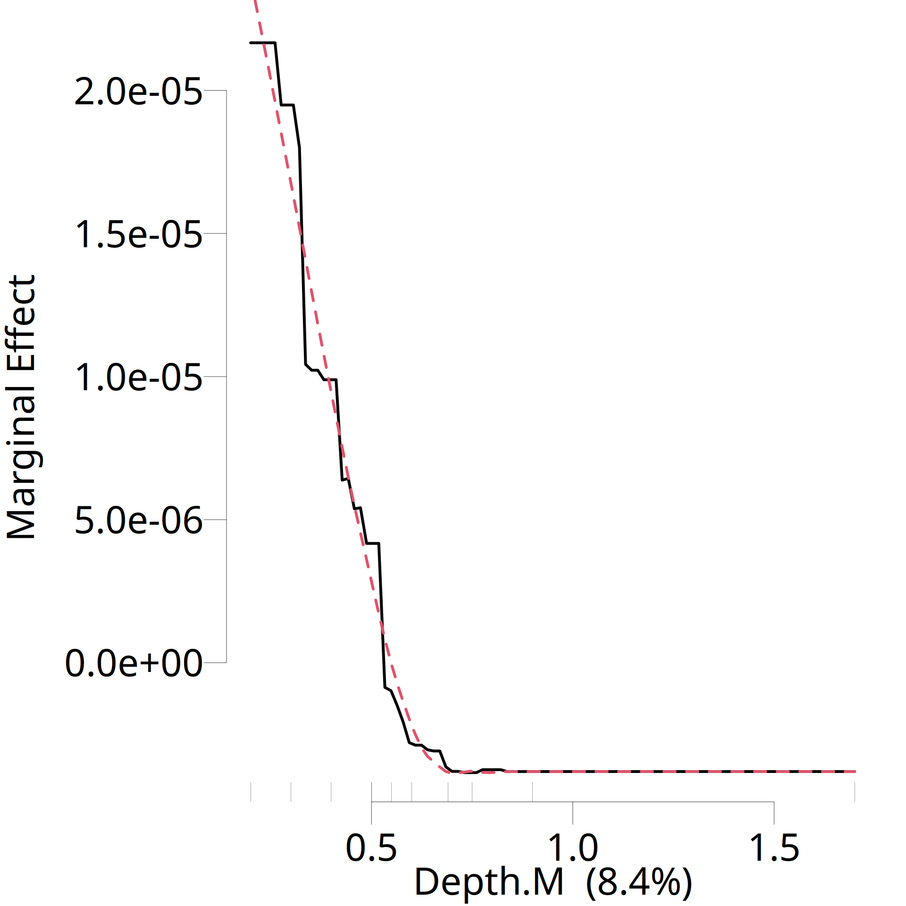
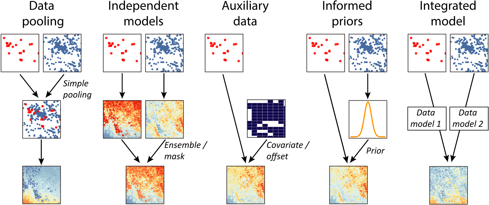
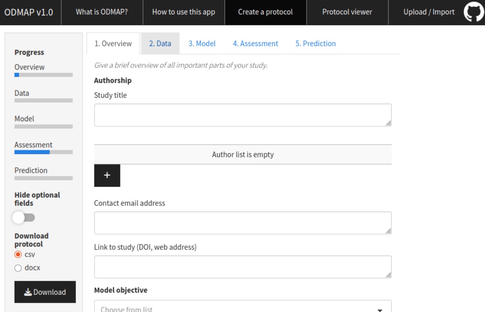

```{r setup, include=FALSE}
options(htmltools.dir.version = FALSE)
knitr::opts_chunk$set(
  fig.width = 10, fig.height = 6, fig.retina = 3,
  out.width = "100%",
  message = FALSE, warning = FALSE,
  cache = FALSE, echo = TRUE
)
library(tidyverse)
library(patchwork)
library(sf)
```

class: inverse, center, middle

# TidyModels for Species Distribution Modelling

## A BRT/xgBoost Workflow

.gold[**Simon Dedman**]

.gold[simondedman@gmail.com]

.gold[simondedman.com]

.gold[March 04, 2026]


---

# What We'll Cover

.pull-left[
### Foundations
- 4 &ndash; The Data Science Workflow
- 5 &ndash; Where Modelling Fits
- 7 &ndash; TidyModels Ecosystem Overview

### Core Packages
- 9 &ndash; Data Splitting (*rsample*, *spatialsample*)
- 12 &ndash; Feature Engineering (*recipes*)
- 14 &ndash; Model Specification (*parsnip*)
- 17 &ndash; Workflow Bundling (*workflows*)
- 18 &ndash; Hyperparameter Tuning (*dials*, *tune*)
- 20 &ndash; Model Evaluation (*yardstick*)
]

.pull-right[
### Advanced Topics
- 23 &ndash; Model Interpretation (*vip*, *DALEX*)
- 26 &ndash; Class Imbalance (*themis*)
- 28 &ndash; Complementary Packages

### SDM Best Practices
- 33 &ndash; Variable Selection
- 34 &ndash; Spatial Autocorrelation
- 35 &ndash; Temporal Resolution
- 36 &ndash; Data Integration
- 37 &ndash; BART Alternative
- 38 &ndash; Validation

### Practical Application
- 40 &ndash; Complete Workflow Example
- 43 &ndash; Parameter Mapping
- 44 &ndash; Key Takeaways
]

---
class: inverse, center, middle

# The Data Science Workflow

---

# The 10-Step Data Workflow

| Step | Operation | Rationale | Key Functions |
|:----:|-----------|-----------|---------------|
| 1 | **Import & Inspect** | Understand structure first | `read_csv()`, `glimpse()` |
| 2 | **Tidy (Reshape)** | 1 row per observation | `pivot_longer()`, `pivot_wider()` |
| 3 | **Filter & Subset** | Reduce data early | `filter()`, `slice()` |
| 4 | **Join (Merge)** | Combine before transformations | `left_join()`, `inner_join()` |
| 5 | **Clean & Convert** | Fix quality issues | `mutate()`, `case_when()` |
| 6 | **Create Variables** | Derive new features | `mutate()`, `transmute()` |
| 7 | **Group & Summarise** | Aggregate after transforms | `group_by()`, `summarise()` |
| 8 | **Arrange (Sort)** | Order for presentation | `arrange()`, `desc()` |
| 9 | **Select Columns** | Final column selection | `select()`, `rename()` |
| 10 | **Output/Visualise** | Export or visualise | `write_csv()`, `ggplot()` |

.small-text[*Steps 5-6 overlap with `recipes` preprocessing — in a modelling workflow, these transformations are handled by `step_*()` functions*]

---

# Where Modelling Fits

.pull-left[
**Transform-Visualise-Model is an iterative loop**

- TidyModels lives in the **MODEL** stage of this diagram
- You enter modelling after **IMPORT → TIDY → TRANSFORM** (variable creation)
- But model results often send you back to **TRANSFORM** (and even **IMPORT**) to refine variables
]

.pull-right[
<div style="font-size:0.85em; line-height:1.3; display:flex; align-items:stretch; justify-content:center;">
<div style="display:flex; flex-direction:column; align-items:center;">
<div style="border:2px solid #081E3F; border-radius:6px; padding:4px 14px; background:#f5f5f5; margin:2px 0;"><b>IMPORT</b></div>
<div style="font-size:1.1em; line-height:0.9;">&#8595;</div>
<div style="border:2px solid #081E3F; border-radius:6px; padding:4px 14px; background:#f5f5f5; margin:2px 0;"><b>TIDY</b></div>
<div style="font-size:1.1em; line-height:0.9;">&#8595;</div>
<div style="border:2px solid #081E3F; border-radius:6px; padding:4px 14px; background:#f5f5f5; margin:2px 0;"><b>TRANSFORM</b></div>
<div style="font-size:1.1em; line-height:0.9;">&#8595; &#8593;</div>
<div style="border:2px solid #081E3F; border-radius:6px; padding:4px 14px; background:#f5f5f5; margin:2px 0;"><b>VISUALISE</b></div>
<div style="font-size:1.1em; line-height:0.9;">&#8595; &#8593;</div>
<div style="border:2px solid #B6862C; border-radius:6px; padding:4px 14px; background:#fdf6ec; margin:2px 0;"><b>MODEL</b></div>
<div style="font-size:1.1em; line-height:0.9;">&#8595;</div>
<div style="border:2px solid #081E3F; border-radius:6px; padding:4px 14px; background:#f5f5f5; margin:2px 0;"><b>COMMUNICATE</b></div>
</div>
<div style="display:flex; flex-direction:column; align-items:center; margin-left:6px;">
<div style="height:110px;"></div>
<div style="border-right:3px solid #B6862C; border-top:3px solid #B6862C; border-bottom:3px solid #B6862C; width:18px; border-radius:0 8px 8px 0; height:115px;"></div>
<span style="font-size:0.75em; color:#B6862C; font-style:italic; margin-top:2px;">iterate</span>
</div>
</div>
]

---
class: inverse, center, middle

# TidyModels Ecosystem

---

# TidyModels Workflow Map

.pull-left[
<div style="font-size:0.72em; line-height:1.2;">
<div style="display:flex; gap:6px; align-items:center; margin-bottom:1px;">
<div style="border:2px solid #081E3F; border-radius:6px; padding:2px 8px; background:#f5f5f5;"><b>✂️ rsample</b></div>
<span style="font-size:1.1em;">&#8594;</span>
<div style="border:2px solid #081E3F; border-radius:6px; padding:2px 8px; background:#f5f5f5;"><b>✂️🗺️ spatialsample</b></div>
</div>
<div style="padding-left:140px; font-size:1.1em; line-height:0.7;">&#8595;</div>
<div style="display:inline-block; border:2px solid #B6862C; border-radius:8px; padding:4px 10px 3px; background:#fdf6ec; margin-bottom:1px;">
<div style="font-size:0.8em; color:#B6862C; font-weight:bold; margin-bottom:2px;">🔗 workflows</div>
<div style="display:flex; gap:6px;">
<div style="border:2px solid #081E3F; border-radius:6px; padding:2px 8px; background:#f5f5f5;"><b>👨‍🍳 recipes</b></div>
<div style="border:2px solid #081E3F; border-radius:6px; padding:2px 8px; background:#f5f5f5;"><b>⚙️ parsnip</b></div>
</div>
</div>
<div style="padding-left:60px; font-size:1.1em; line-height:0.7;">&#8595;</div>
<div style="display:flex; gap:6px; align-items:center; margin-bottom:1px;">
<div style="border:2px solid #B6862C; border-radius:6px; padding:2px 10px; background:#fdf6ec;"><b>🔍 tune</b></div>
<span style="font-size:1.1em;">&#8592;</span>
<div style="border:2px solid #081E3F; border-radius:6px; padding:2px 10px; background:#f5f5f5;"><b>🎛️ dials</b></div>
</div>
<div style="padding-left:20px; font-size:1.1em; line-height:0.7;">&#8595;</div>
<div style="display:inline-block; border:2px solid #081E3F; border-radius:6px; padding:2px 10px; background:#f5f5f5; margin-bottom:1px;"><b>📈 yardstick</b></div>
<div style="padding-left:20px; font-size:1.1em; line-height:0.7;">&#8595;</div>
<div style="display:inline-block; border:2px solid #081E3F; border-radius:6px; padding:2px 10px; background:#f5f5f5; margin-bottom:1px;"><b>📈 vip / DALEX</b></div>
<div style="padding-left:20px; font-size:1.1em; line-height:0.7;">&#8595;</div>
<div style="display:inline-block; border:2px solid #081E3F; border-radius:6px; padding:2px 10px; background:#f5f5f5;"><b>🗺️ predict()</b></div>
</div>
]

.pull-right[
.small-text[
| Package | Purpose | Key Functions |
|---------|---------|---------------|
| ✂️ **rsample** | Data splitting | `initial_split()`, `vfold_cv()` |
| ✂️🗺️ **spatialsample** | Spatial CV (SDMs!) | `spatial_block_cv()` |
| 👨‍🍳 **recipes** | Feature engineering | `recipe()`, `step_*()` |
| ⚙️ **parsnip** | Model interface | `boost_tree()`, `set_engine()` |
| 🔗 **workflows** | Bundle recipe + model | `workflow()`, `add_recipe()` |
| 🎛️ **dials** | Parameter specs | `grid_space_filling()` |
| 🔍 **tune** | Hyperparameter tuning | `tune_grid()`, `select_best()` |
| 📈 **yardstick** | Metrics | `roc_auc()`, `metric_set()` |
]
]

---
class: inverse, center, middle

# Data Splitting

✂️ Partition data for training and evaluation

*rsample* & *spatialsample*

---

# ✂️ rsample: Standard Data Splitting 

Hold out data the model hasn't seen, so we can test whether it generalises.

.pull-left[
```r
library(rsample)
# 80/20 split, stratified by outcome
split <- initial_split(data, prop = 0.8,
                       strata = presence)
train_data <- training(split)
test_data  <- testing(split)
# 10-fold cross-validation
folds <- vfold_cv(train_data, v = 10,
                  strata = presence)
```

| Function | Description |
|----------|-------------|
| `initial_split()` | Train/test split |
| `training()` / `testing()` | Extract sets |
| `vfold_cv()` | V-fold CV |
| `bootstraps()` | Bootstrap resampling |
| `group_vfold_cv()` | CV respecting groups |
]

.pull-right[
```{r train-test-cv, eval=TRUE, echo=FALSE, fig.width=5, fig.height=4.5, out.width="100%"}
# Train/test split visualisation
set.seed(1)
split_df <- tibble(
  id = 1:10,
  x = rep(seq(0.5, 4.5, 1), 2),
  y = rep(c(2, 1), each = 5),
  role = c(rep("Train (80%)", 8), rep("Test (20%)", 2)))

p1 <- ggplot(split_df, aes(x = x, y = y, fill = role)) +
  geom_point(shape = 21, size = 6, colour = "grey30") +
  scale_fill_manual(values = c("Train (80%)" = "#3B7DD8", "Test (20%)" = "#E04040")) +
  labs(title = "Train / Test Split", fill = NULL) +
  theme_void(base_size = 11) +
  theme(legend.position = "bottom",
        legend.margin = margin(0, 0, 0, 0),
        plot.title = element_text(hjust = 0.5, face = "bold"),
        plot.margin = margin(2, 2, 2, 2)) +
  ylim(0.5, 2.5)

# 5-fold CV grid
cv_df <- expand_grid(fold = 1:5, obs = 1:5) |>
  mutate(role = if_else(fold == obs, "Validation", "Train"))

p2 <- ggplot(cv_df, aes(x = obs, y = fold, fill = role)) +
  geom_tile(colour = "white", linewidth = 1.2) +
  scale_fill_manual(values = c("Train" = "#3B7DD8", "Validation" = "#E04040")) +
  scale_y_reverse(breaks = 1:5, labels = paste("Fold", 1:5)) +
  scale_x_continuous(breaks = 1:5, labels = paste("Block", 1:5)) +
  labs(title = "5-Fold Cross-Validation", fill = NULL) +
  theme_minimal(base_size = 11) +
  theme(legend.position = "bottom",
        legend.margin = margin(0, 0, 0, 0),
        plot.title = element_text(hjust = 0.5, face = "bold"),
        panel.grid = element_blank(),
        plot.margin = margin(2, 2, 2, 2))

p1 / plot_spacer() / p2 + plot_layout(heights = c(1, 0.1, 1.3))
```
]

---

# ✂️🗺️ spatialsample: Critical for SDMs! 

.pull-left[
### Why Spatial CV?

- Standard CV ignores **spatial autocorrelation**
- Nearby points are often more similar&nbsp;(Tobler's&nbsp;first&nbsp;law)
- Without spatial CV, models appear **better than they truly are**

### Key Functions

| Function | Description |
|----------|-------------|
| `spatial_block_cv()` | Block-based CV |
| `spatial_clustering_cv()` | K-means clustering CV |
| `spatial_buffer_vfold_cv()` | V-fold with buffers |
| `spatial_nndm_cv()` | Nearest neighbour matching |
]

.pull-right[
```r
library(spatialsample)
train_sf <- st_as_sf(train_data,
  coords = c("lon", "lat"), crs = 4326,
  remove = FALSE) |>
  st_transform(crs = 32629) # UTM 29N
spatial_folds <- spatial_block_cv(
  train_sf, v = 10, cellsize = 50000)
autoplot(spatial_folds)
```

.smaller-text[
Cell size must be in metres, not degrees: EPSG:4326 will fail. Convert train_sf with `sf::st_transform(crs = 32629)`
]

```{r florida-blocks, eval=TRUE, echo=FALSE, fig.width=4.5, fig.height=2.8, out.width="100%"}
florida <- map_data("state", region = "florida")
fl_bbox <- tibble(xmin = -88, xmax = -79, ymin = 24, ymax = 31)
grid_size <- 0.5
grid_df <- expand_grid(
  x = seq(fl_bbox$xmin, fl_bbox$xmax, grid_size),
  y = seq(fl_bbox$ymin, fl_bbox$ymax, grid_size)) |>
  mutate(block_id = row_number())
set.seed(42)
grid_df <- grid_df |>
  mutate(fold = factor(sample(rep(1:5, length.out = n()))))
ggplot() +
  geom_tile(data = grid_df, aes(x = x, y = y, fill = fold),
            colour = "white", linewidth = 0.1, alpha = 0.6) +
  geom_polygon(data = florida, aes(x = long, y = lat, group = group),
               fill = "grey40", colour = "grey20") +
  scale_fill_brewer(palette = "Set2", name = "Fold") +
  coord_quickmap(xlim = c(-87, -79.5), ylim = c(24.5, 30.5)) +
  labs(x = "Longitude", y = "Latitude") +
  theme_minimal(base_size = 9) +
  theme(legend.position = "right", legend.key.size = unit(0.3, "cm"),
        panel.grid = element_line(colour = "grey90"))
```
.small-text[~50 km spatial blocks, Florida]
]

---
class: inverse, center, middle

# Feature Engineering

👨‍🍳 Select and transform predictor variables

*recipes*

---

# 👨‍🍳 *recipes*: The Preprocessing Engine 

Define a reusable pipeline of variable selection and transformation steps.

```r
rec <- recipe(presence ~ ., data = train_data) |>         # formula + data
  update_role(lon, lat, new_role = "coordinates") |>      # exclude coords from model
  step_impute_median(all_numeric_predictors()) |>         # fill NAs with medians
  step_nzv(all_predictors()) |>                           # drop near-zero variance
  step_corr(all_numeric_predictors(), threshold = 0.9) |> # drop correlated (VIF)
  step_normalize(all_numeric_predictors()) |>             # centre & scale
  step_dummy(all_nominal_predictors())                    # one-hot encode factors
```

.small-text[
| Category | Purpose | Steps |
|----------|---------|-------|
| **Role assignment** | Exclude non-predictor cols | `update_role()`, `add_role()`, `remove_role()` |
| **Missing Data** | Handle NAs | `step_impute_median()`, `step_impute_mean()`, `step_impute_knn()` |
| **Filtering** | Remove redundant vars | `step_nzv()`, `step_corr()`, `step_zv()` |
| **Transformations** | Transform distributions | `step_log()`, `step_sqrt()`, `step_BoxCox()` |
| **Normalization** | Scale predictors | `step_normalize()`, `step_range()`, `step_center()` |
| **Encoding** | Categorical to numeric | `step_dummy()`, `step_other()`, `step_integer()` |
| **Interactions** | Create interactions | `step_interact()`, `step_poly()` |
]

See all available steps at [recipes.tidymodels.org/reference/](https://recipes.tidymodels.org/reference/)

.small-text[`prep()` and `bake()` are called automatically by workflows — you rarely need them directly.]

---
class: inverse, center, middle

# Model Specification

⚙️ Define the model type, engine, and hyperparameters

*parsnip* & *boost_tree()*

---

# ⚙️ parsnip: Unified Model Interface 

A single interface to many model types — swap engines without rewriting code.

.pull-left[
### Key Concepts

- **Type:** Model category (random forest, boosted trees)
- **Mode:** Task type (regression, classification)
- **Engine:** Underlying package (xgboost, ranger)

### Model Types in parsnip

.small-text[
`boost_tree()` `rand_forest()` `logistic_reg()` `decision_tree()` `bart()` `mlp()` `svm_rbf()` `svm_linear()` `nearest_neighbor()` `mars()` `gen_additive_mod()`
]

### Engines for boost_tree()

- `xgboost` (default) — Extreme Gradient Boosting
- `lightgbm` — Light Gradient Boosting Machine
- `C5.0` — classification-only (C50 package)
- Also: `mboost`, `h2o`, `spark`
]

.pull-right[
```r
library(parsnip)

brt_spec <- boost_tree(
  trees = 1000,
  tree_depth = tune(),
  min_n = tune(),
  learn_rate = tune(),
  mtry = tune(),
  sample_size = tune(),
  loss_reduction = tune()
) |>
  set_engine("xgboost") |>
  set_mode("classification")
# tune(): placeholder for tune_grid() [18]
```
]

---

# ⚙️ boost_tree() Hyperparameters for SDMs 

| Hyperparameter | Description | Recommended Range | Ecological Context |
|-----------|-------------|------------------|-------------------|
| `trees` | Number of trees | 500-2000 | Usually sufficient for SDMs |
| `tree_depth` | Maximum depth | 3-8 | Depth 3-6 captures most interactions |
| `min_n` | Min observations in node | 5-30 | Higher prevents rare habitat noise |
| `learn_rate` | Shrinkage | 0.001-0.1 | Lower = better generalization |
| `mtry` | Predictors per split | sqrt(p) to p/3 | Standard ML practice |
| `sample_size` | Data proportion/tree | 0.5-0.9 | Reduces overfitting |
| `loss_reduction` | Min loss for split | 0-5 | Regularization hyperparameter |

---
class: inverse, center, middle

# Bundling & Tuning

🔗🎛️🔍 Combine preprocessing and model; optimise settings

*workflows*, *dials*, *tune*

---

# 🔗 *workflows*: Bundle Everything 

Bundle recipe + model into one object so `fit()` handles everything.

.pull-left[
```r
library(workflows)
brt_wf <- workflow() |>
  add_recipe(rec) |>
  add_model(brt_spec)
# fit(brt_wf, data = train_data)
#   ^ needs final hyperparams
# predict(brt_fit, new_data = test_data)
#   ^ after fit()
```

### Advantages

1. Single `fit()` handles prep + train
2. **Consistent preprocessing** at prediction
3. Simplified tuning integration
]

.pull-right[
<div style="text-align:center; font-size:0.85em; line-height:1.3; margin-top:10px;">
<div style="display:flex; justify-content:center; gap:12px; margin-bottom:4px;">
<div style="border:2px solid #081E3F; border-radius:6px; padding:4px 14px; background:#f5f5f5;"><b>👨‍🍳 recipe</b><br><small>(rec)</small></div>
<div style="border:2px solid #081E3F; border-radius:6px; padding:4px 14px; background:#f5f5f5;"><b>⚙️ parsnip</b><br><small>(brt_spec)</small></div>
</div>
<div style="font-size:1.3em; line-height:1;">&#8600; &nbsp;&nbsp;&nbsp; &#8601;</div>
<div style="display:inline-block; border:2px solid #B6862C; border-radius:6px; padding:5px 20px; background:#fdf6ec; margin:3px 0;"><b>🔗 workflow</b></div>
<br><div style="font-size:1.3em; line-height:1;">&#8595;</div>
<div style="display:inline-block; border:2px solid #081E3F; border-radius:6px; padding:4px 20px; margin:3px 0;"><b>🎛️🔍 tune_grid()</b></div>
<br><div style="font-size:1.3em; line-height:1;">&#8595;</div>
<div style="display:inline-block; border:2px solid #081E3F; border-radius:6px; padding:4px 20px; margin:3px 0;"><b>finalize_workflow()</b></div>
<br><div style="font-size:1.3em; line-height:1;">&#8595;</div>
<div style="display:inline-block; border:2px solid #081E3F; border-radius:6px; padding:4px 20px; margin:3px 0;"><b>fit()</b></div>
<br><div style="font-size:1.3em; line-height:1;">&#8595;</div>
<div style="display:inline-block; border:2px solid #081E3F; border-radius:6px; padding:4px 20px; margin:3px 0;"><b>🗺️ predict()</b></div>
</div>
]

---

# 🎛️🔍 *dials* & *tune*: Hyperparameter Tuning  

.pull-left[
### Create Hyperparameter Grid & Tune

```r
library(dials); library(tune)

brt_params <- brt_wf |>
  extract_parameter_set_dials() |>
  finalize(train_data)

brt_grid <- grid_space_filling(
  brt_params, size = 30)

tune_results <- tune_grid(
  brt_wf, resamples = spatial_folds,
  grid = brt_grid,
  metrics = metric_set(roc_auc, accuracy),
  control = control_grid(save_pred = TRUE))

# Pick simplest model within 1 SE of best
best <- select_by_one_std_err(
  tune_results, metric = "roc_auc",
  desc(learn_rate))
```

### Finalize & Predict

```r
final_wf <- finalize_workflow(brt_wf, best)
brt_fit <- fit(final_wf, data = train_data)
predict(brt_fit, new_data = test_data)
```
]

.pull-right[
### Tuning Strategies

.small-text[
| Method | Function | How it works |
|--------|----------|--------------|
| **Grid** | `tune_grid()` | All combinations — exhaustive |
| **Space-filling** | `grid_space_filling()` | Even coverage of parameter space |
| **Bayesian** | `tune_bayes()` | Past results guide search |
| **Racing ANOVA** | `tune_race_anova()` | Drop poor early — fast |
]

### Recommended Strategy for SDMs

1. **Start:** Space-filling grid (30-50 points)
2. **If needed:** Racing methods for larger grids
3. **Refine:** Bayesian optimisation around best regions
4. **Select:** `select_by_one_std_err()` — picks the simplest model whose performance is within one standard error of the best (parsimony over raw score); `select_best()`: model with best score for chosen metric
]

---
class: inverse, center, middle

# Model Evaluation

📈 Measure how well the model performs

*yardstick*

---

# 📈 yardstick: Performance Metrics 

Quantify model skill using metrics suited to presence/absence data.

.pull-left[
### Classification Metrics for SDMs

.small-text[
| Function | Description |
|----------|-------------|
| `roc_auc()` | Area under ROC curve |
| `mcc()` | **Matthews correlation coef** (selection metric) |
| `j_index()` | TSS: sens + spec - 1 (Allouche 2006) |
| `sedi()` | **SEDI** (custom; use when prevalence < 2.5%) |
| `roc_auc()` | Area under ROC curve |
| `pr_auc()` | Precision-recall AUC (better for rare spp.) |
| `sens()` / `spec()` | Sensitivity / Specificity |
| `kap()` | Cohen's Kappa |
| `f_meas()` | F1 score |
| `mn_log_loss()` | Mean log loss (calibration) |
]

### Create Metric Set

```r
sdm_metrics <- metric_set(
  roc_auc, pr_auc, mn_log_loss,  # probability
  mcc, j_index, kap, f_meas,     # hard-class
  sens, spec, ppv, npv, sedi     # components + SEDI
)
```
]

.pull-right[
### Finalize and Evaluate

```r
# Select best parameters
best_params <- select_best(
  tune_results,
  metric = "mcc"  # Matthews correlation coefficient
)

# Finalize workflow
final_workflow <- finalize_workflow(
  brt_workflow,
  best_params
)

# Evaluate on test set
final_fit <- last_fit(
  final_workflow,
  split = data_split,
  metrics = sdm_metrics
)

collect_metrics(final_fit)
```
]

---

# Metrics in Context

.pull-left[
### The Confusion Matrix

| | **Predicted Present** | **Predicted Absent** |
|:---|:---:|:---:|
| **Actual Present** | TP | FN |
| **Actual Absent** | FP | TN |

- **TP/FP/TN/FN** underpin every classification metric
- A model with 95% accuracy can still miss every rare species occurrence
- Practical resolution limits how useful predictions really are

### Data Reliability

- Absences are often **pseudo-absences** (not confirmed absence)
- Detection probability varies by species, method, and season
- Missing variables can systematically bias predictions
]

.pull-right[
### Management Decisions

Model outputs rarely stand alone — they feed into decisions:

- **Binary**: protect/don't protect (thumbs up/down)
- **Traffic light**: high/medium/low priority
- **Continuous**: probability surfaces for spatial planning

### What Metrics Don't Capture

- Whether the **right variables** were included
- Whether the **spatial extent** matches the management question
- Whether **temporal dynamics** were accounted for
- Whether the model is **ecologically plausible**

> Good metrics + bad data = confident bad decisions
]

---
class: inverse, center, middle

# Model Interpretation

Understand what the model has learnt

*vip*, *DALEX*, PDPs

---

# 📈 Variable Importance with vip 

Identify which predictors drive the model's predictions.

.pull-left[
### Native XGBoost Importance

```r
library(vip)

fitted_model <- extract_fit_parsnip(final_fit)

# Native importance
vip(fitted_model, num_features = 15)
```

### Permutation Importance

```r
pfun <- function(object, newdata)
  predict(object, new_data = newdata,
          type = "prob")$.pred_present
auc_m <- function(truth, estimate)
  roc_auc_vec(truth, estimate,
              event_level = "second")
vi_perm <- vi(fitted_model,
  method = "permute", train = train_data,
  target = "presence", metric = auc_m,
  pred_wrapper = pfun,
  smaller_is_better = FALSE, nsim = 30)
vip(vi_perm, num_features = 15)
```
]

.pull-right[
### Why Permutation?

- **Native importance:** Based on split frequency/gain
- **Permutation:** Model-agnostic, measures true impact
- **For SDMs:** Permutation is more reliable for ecological interpretation

Always report **which method** was used!

.small-text[
**gbm.auto:** includes a random variable to compare relative influence against.
<br>**Müller et al. 2013:** focus on variables with rel.inf > than expected by chance (100/number of variables)
]

.footnote[[Müller et al. 2013](https://doi.org/10.1016/j.agsy.2012.12.010)]
]

---

# 📈 Partial Dependence with DALEX  

Visualise how each predictor affects the predicted outcome.

.pull-left[
```r
library(DALEXtra)

# Create explainer
explainer <- explain_tidymodels(
  final_fit$.workflow[[1]],
  data = train_data |> select(-presence),
  y = as.numeric(
    train_data$presence == "present"),
  label = "BRT SDM",
  verbose = FALSE)

# Partial dependence plots
pdp_depth <- model_profile(
  explainer, variables = "depth", N = 500)
plot(pdp_depth)

# Multiple variables
pdp_multi <- model_profile(
  explainer,
  variables = c("depth", "sst", "chlorophyll"),
  N = 500)
plot(pdp_multi)
```
]

.pull-right[
<div style="display:flex; align-items:flex-start; gap:4px;">


</div>

]

---
class: inverse, center, middle

# Class Imbalance

Handle unequal presence/absence ratios

*themis*

---

# Handling Class Imbalance in SDMs 

SDM data often have far more absences than presences.

.pull-left[
### themis Package Methods

| Method | Description | Function |
|--------|-------------|----------|
| **Upsampling** | Replicate minority | `step_upsample()` |
| **Downsampling** | Remove majority | `step_downsample()` |
| **SMOTE** | Interpolate minority neighbours, create synthetic points | `step_smote()` |
| **ADASYN** | SMOTE, more points in low-density regions | `step_adasyn()` |

### Recipe with SMOTE

```r
library(themis)

rec_balanced <- recipe(presence ~ .,
                       data = train_data) |>
  step_impute_median(all_numeric()) |>
  step_smote(presence, over_ratio = 0.5) |>
  step_normalize(all_numeric())
```
]

.pull-right[
### Alternative: Class Weights

```r
# Calculate ratio
neg_pos_ratio <-
  sum(train_data$presence == "absent") /
  sum(train_data$presence == "present")

# Add to engine
brt_spec_weighted <- boost_tree(
  trees = 1000
) |>
  set_engine(
    "xgboost",
    scale_pos_weight = neg_pos_ratio
  ) |>
  set_mode("classification")
```

**Note:** SMOTE requires dummy encoding before application. Rare species with < 2.5% prevalence suffer extreme zero-inflation — standard resampling may not help; MCC/TSS also unreliable. Consider the **SEDI** metric [38].

[Lopez et al. 2022](https://www.iattc.org/GetAttachment/ec8a1a22-3e24-4d0f-bf12-69634843b314/BYC-11-01_Species-distribution-modelling-leatherback-turtle.pdf): Tested from 99.81% (original) to 50% absences (downsampled); 75% was best model: imbalance is ok, within reason.
]

---
class: inverse, center, middle

# Complementary Packages

Spatial, SDM-specific, Interpretation

---

# 🗺️ Spatial Data Packages   

| Package | Purpose | Key Functions |
|---------|---------|---------------|
| **sf** | Vector spatial data | `st_read()`, `st_as_sf()`, `st_transform()` |
| **terra** | Raster processing | `rast()`, `extract()`, `writeRaster()` |
| **tidyterra** | ggplot2 for terra | `geom_spatraster()`, `geom_spatvector()` |
| **stars** | Spatiotemporal arrays | Time-series rasters, NetCDF |

```r
# Build raster stack from grids.rds (irregular → rasterize to 0.01° grid)
env_cols <- c("depth", "sst", "Salinity", "Current_Speed")
grids_vect <- vect(grids, geom = c("lon", "lat"), crs = "EPSG:4326")
template   <- rast(ext(grids_vect), resolution = 0.01, crs = "EPSG:4326")
env_stack  <- rasterize(grids_vect, template, field = env_cols, fun = mean)

# Presence-only occurrences → sf
occurrences_sf <- samples |>
  filter(presence == "present") |>
  st_as_sf(coords = c("lon", "lat"), crs = 4326, remove = FALSE)

# Extract environmental values at occurrence points
env_values <- extract(env_stack, vect(occurrences_sf), ID = FALSE)
```

.small-text[
**REMOVED:** rgdal (sf, terra), rgeos (sf), maptools (sf), ggsn (ggspatial)
<br>**SUPERSEDED:** sp (sf), raster (terra), dismo (predicts + terra), rasterVis (tidyterra), spacetime (stars)
<br>**OUTDATED:** maps/mapdata/rworldmap/rworldxtra (rnaturalearth), mapplots (sf + ggplot2), OpenStreetMap (maptiles), RgoogleMaps (maptiles/ggmap), mapproj (sf::st\_transform), geosphere (terra)
]

---

# SDM-Specific Packages  

| Package | Purpose | When to Use |
|---------|---------|-------------|
| **tidysdm** | Tidy SDM helpers | Thinning, pseudo-absences, threshold calibration |
| **dismo** | Classic BRTs | Reproducing Elith et al. 2008 method |
| **gbm.auto** | Automated BRTs | Simplified gbm.step wrapper, mapping (Dedman et al. 2017) |
| **biomod2** | Ensemble SDMs | Multi-algorithm comparison |
| **ENMeval** | Maxent tuning | Maxent-focused workflows |
| **ecospat** | Niche analysis | Niche overlap, range dynamics |

### tidysdm Example

```r
library(tidysdm)
# Thin occurrences to one per raster cell
thinned <- thin_by_cell(occurrences_sf, raster = env_stack,
                        coords = c("lon", "lat"))
# Generate pseudo-absences (~4:1 ratio)
# thin_by_cell renames coords to X/Y, auto-detected here
pseudoabs <- sample_pseudoabs(thinned, n = 1000, raster = env_stack,
                              method = "random")
# Threshold calibration (requires fitted tidysdm ensemble)
# calibrated <- calib_class_thresh(sdm_ensemble, class_thresh = "tss")
```

Random pseudoabsence generation within the activity space performs better than random walk (Hazen et al. 2021)

.footnote[[Elith et al. 2008](https://doi.org/10.1111/j.1365-2656.2008.01390.x) · [Dedman et al. 2017](https://doi.org/10.1371/journal.pone.0188955) · [Hazen et al. 2021](https://doi.org/10.1186/s40462-021-00240-2)]

---

# Spatial CV Comparison

| Feature | spatialsample | blockCV | CAST |
|---------|--------------|---------|------|
| **TidyModels integration** | Native | Compatible | Compatible |
| **Block CV** | Yes | Yes | Yes |
| **Clustering CV** | Yes | Yes | Yes |
| **Autocorrelation estimation** | No | **Yes** | No |
| **Environmental blocking** | No | **Yes** | Yes |
| **Area of Applicability** | No | No | **Yes** |
| **Forward Feature Selection** | No | No | **Yes** |

### When to Use What

- **spatialsample:** Standard tidymodels workflow — start here
- **blockCV:** Need autocorrelation estimation or environmental blocking
- **CAST:** Area of applicability analysis or forward feature selection

**Decision guidance:** **Autocorrelation estimation** (blockCV) is recommended for any SDM to choose appropriate block sizes. Start with spatialsample for the workflow, but use blockCV's `cv_spatial_autocor()` to set your block size. **Environmental blocking** partitions data by environmental similarity (e.g. clustering in climate space) rather than geographic proximity — useful when testing transferability across environmental gradients. Use **CAST** if you need to map where predictions are trustworthy (Area of Applicability). **Forward Feature Selection** (CAST) iteratively builds a model by adding the most predictive variable at each step, using spatial CV performance to decide when to stop — avoids overfitting from irrelevant predictors.

---

# 🗺️ Area of Applicability (CAST)  

Compare model predictions to training data coverage — flag extrapolation.

.pull-left[
```r
library(CAST)

# Calculate area of applicability
aoa_result <- aoa(
  newdata = env_df,
  model = final_fit,
  trainDI = trainDI(
    model = final_fit,
    train = train_data)
)

# Visualize where predictions are reliable
plot(aoa_result)

# Mask predictions outside AOA
pred_masked <- pred_rast
pred_masked[aoa_result$AOA == 0] <- NA
```

**Why AOA matters:** Identifies regions where your model is extrapolating beyond training conditions

**Note:** `gbm.auto::gbm.rsb()` provides a related approach — maps representativeness to flag areas of low training-data support.
]

.pull-right[

]

---
class: inverse, center, middle

# SDM Best Practices

Synthesis from Recent Literature

---

# Variable Selection: The Evidence

.pull-left[
### Pre-modelling

- Use **VIF < 10** threshold for collinearity (Yavas et al. 2024): run `car::vif()` first [12: `step_corr` is coarser]
- Prefer **direct variables over proxies** (e.g., temperature over elevation)
- **Variable selection** and processing can be more impactful than everything else [12,26,29 & L4 63-76]
- Use **ecological knowledge** to guide selection, not just statistics (Causal Thinking)
- Consider **Information Gain** ranking (measures how much a predictor reduces uncertainty about the response) for optimal feature subsets — in tidymodels, the `colino` package provides `step_select_infgain()` as a recipe step, or use `FSelectorRcpp::information_gain()` for pre-screening

### Within-model (BRT/xgBoost)

- **Don't have to remove** correlated variables — regularised methods handle multicollinearity (Elith et al. 2011)
- ML methods capture correlated effects naturally
]

.pull-right[
### Post-modelling

- Assess **permutation importance** (model-agnostic), not just native [23]
- Check for **equifinality** — multiple parameterisations may fit equally well (Dormann et al. 2012) [23]

### Key Insight

> "The inclusion of highly correlated predictors is not necessarily problematic for BRTs because the algorithm can select among correlated variables at each split" — Elith et al. 2008

### Experiential Counterpoint

> "Highly correlated predictors can correlate to random variance by chance, and can split high explained-variance among 2+ predictors instead of 1, suggesting both are of modest importance, instead of 1 being highly important" — Dedman, this lecture
]

<div style="position:absolute; bottom:3em; right:20px; font-size:100%;"><a href="https://doi.org/10.1038/s41598-024-76483-x">Yavas et al. 2024</a> · <a href="https://doi.org/10.1111/j.1472-4642.2010.00725.x">Elith et al. 2011</a> · <a href="https://doi.org/10.1111/j.1365-2699.2011.02659.x">Dormann et al. 2012</a></div>

---

# Spatial Autocorrelation Matters

.pull-left[
### Detection

- See [Lecture 4 Simon resources](https://fiu.instructure.com/courses/247741/files/folder/Code%20%26%20data/Lecture%204%20Simon%20resources/Others%20Code%20Dumps/Ally-Jones-spatial-autocorrelation?preview=41961921); [Lecture 8 Simon resources](https://fiu.instructure.com/courses/247741/files/folder/Code%20%26%20data/Lecture%208%20Simon%20resources?preview=42592925); [UCLA Stats](https://stats.oarc.ucla.edu/r/faq/how-can-i-calculate-morans-i-in-r/)
- Use **Moran's I correlograms** on model residuals
- Examine residual patterns visually before concluding no SAC
- SAC in residuals **inflates Type I errors** (detecting effects that aren't there) and biases estimates

### Why It Matters

- 94% of SDM studies fail to report uncertainty (Robinson et al. 2017)
- Standard CV produces **optimistically biased** estimates
- Nearby points are more similar (Tobler's first law)
]

.pull-right[
### Treatment Options (in order of preference)

| Method | Best For |
|--------|----------|
| **Spatial CV** | All SDMs [10, 30] |
| **RAC** | GLMs, 2-stage process |
| **Spatial random effects** | Bayesian models |
| **BART** | Uncertainty quantification [37] |

### Key Insight

> Standard autologistic can suppress environmental variable importance — **RAC (Residual Autocovariate — adds spatial term without suppressing ecological signals) preserves interpretability** (Crase et al. 2012)
]

.footnote[[Robinson et al. 2017](https://doi.org/10.3389/fmars.2017.00421) · [Crase et al. 2012](https://doi.org/10.1111/j.1600-0587.2011.07138.x)]

---

# Matching Temporal Resolution

### Match resolution to ecological question (Mannocci et al. 2017)

.small-text[
| Scale | Covariate Type | Use Case | Example |
|-------|----------------|----------|---------|
| **Fine** | Instantaneous (hours) | Prey patches, hydrodynamics | Real-time bycatch |
| **Meso** | Contemporaneous (days-months) | Seasonal movements | Dynamic management |
| **Macro** | Climatological (long-term) | Migration, range limits | MPA design |
]

### Practical Guidance

- **Static management (MPAs):** Climatological models often sufficient
- **Dynamic management (real-time):** Contemporaneous data essential
- **Warming ecosystems:** Use contemporaneous + long time series
- **8-day climatological** often performs as well as daily for many applications

.footnote[[Mannocci et al. 2017](https://doi.org/10.1111/ddi.12609)]

---

# Data Integration Hierarchy

When combining multiple sources of RESPONSE data, the method of integration matters as much as the data quality.

.small-text[
### How studies combine data sources (Fletcher et al. 2019)

| Approach | Explanation | % Studies | Recommendation |
|----------|-------------|-----------|----------------|
| Simple pooling | Merge all data into one dataset | 73% | **Avoid** — masks sampling differences |
| Independent models | Fit separate models per source | 11% | Qualitative comparison only |
| Auxiliary data | Use secondary data as covariates | 8% | Moderate — adds context |
| Informed priors | Use one dataset to inform Bayesian priors | 1% | Bayesian sequential |
| **Integrated SDMs (ISDMs)** | Joint likelihood across data types | 9% | **Recommended** |
]

.pull-left[
### Key Principles

1. ISDMs link **presence, pres/abs, abundance** data
2. Spatially-varying **thinning** for biased sampling
3. **Weight data** proportionally when sample sizes differ
4. Test **transferability** to new geographic regions

<div style="margin-top:0.5em;"></div>

**2026 status:** [PointedSDMs](https://doi.org/10.1111/2041-210X.14091) and [intSDM](https://doi.org/10.1002/ece3.71029) lower barrier to entry but remain Bayesian w/ no connection to TidyModels. See Isaac et al. 2020 & Dovers et al. 2024.
]

.pull-right[

]

.footnote[[Fletcher et al. 2019](https://doi.org/10.1002/ecy.2710); [Isaac et al. 2020](https://doi.org/10.1016/j.tree.2019.08.006); [Dovers et al. 2024](https://doi.org/10.1111/2041-210X.14252)]

---

# BART: Bayesian Alternative to BRT  

.pull-left[
### Comparison (Sparapani et al. 2021)

| Feature | BRT/xgBoost | BART |
|---------|-------------|------|
| Uncertainty | Point estimates | **Full posteriors** |
| Tuning | Extensive search | **Minimal** |
| Regularization | Via cross-validation | **Bayesian prior** |
| Interpretation | Variable importance | **+ credible intervals** |
| Causal inference | Limited | **Natural** |

### When to Consider BART

- Built-in uncertainty quantification
- Limited time for hyperparameter tuning
- Need **credible intervals** on predictions
- Causal inference questions (treatment effects)
]

.pull-right[

### R Implementation

```r
library(embarcadero)  # Carlson 2020
# Or base BART package:
library(BART)
bart_fit <- pbart(x.train, y.train)
```

### BART in TidyModels

BART slots directly into the same workflow pattern via `parsnip::bart()` with the `dbarts` engine:

```r
bart_spec <- bart(trees = 200) |>
  set_engine("dbarts") |>
  set_mode("classification")
```

### Uncertainty in xgboost/BRTs

**Bootstrapping:** fit multiple models, resampled data, get prediction intervals. For PDPs, VIP barplots, spatial predictions. `gbm.auto::gbm.loop` [[Thesis S5.2.4.4 & 6.6.4](https://drive.google.com/open?id=1mMDrm3vbE3T-fG7kYHHUuUGo5wIXXTQs)]
**Quantile regression:** xgboost models on 5th/50th/95th percentiles
<br>**Conformal prediction:** post-hoc prediction intervals via [probably](https://probably.tidymodels.org/)
]

.footnote[[Sparapani et al. 2021](https://doi.org/10.18637/jss.v097.i01)]

---

# Validation: Beyond AUC

.pull-left[
### Metrics to Use

.small-text[
| Metric | Function | Best For |
|--------|----------|----------|
| **AUC** | Discrimination | Ranking predictions |
| **TSS** | True Skill Stat | General accuracy |
| **SEDI** | Symmetric Extremal | **Low prevalence** |
| **Boyce Index** | Presence-only | Continuous calibration |
| **Block log-lik** | Calibration | Spatial assessment |
]

### Warnings

TSS fails at very low prevalence — use **SEDI** instead (Wunderlich et al. 2019)

TSS supersedes Kappa but typically both TSS and AUC are reported (Allouche et al. 2006)

`yardstick::j_index` is TSS: sensitivity + specificity - 1

Select best on **MCC** (Chicco & Jurman 2020); if prevalence < 2.5%, use **SEDI** instead (custom metric defined in script; PR [#630](https://github.com/tidymodels/yardstick/pull/630))

**Multiclass** (3+ classes, e.g. habitat type): MCC generalises automatically (Gorodkin 2004); SEDI is binary-only
]

.pull-right[
### Validation Principles

1. **External validation > cross-validation** for true assessment [9]
2. Use **simulated species** to assess method reliability
3. Test **multiple equifinal solutions**, not just "best" [23]
4. Quantify uncertainties: data bias, model misspecification

### Reporting Standard

Use **[ODMAP protocol](https://odmap.wsl.ch/)** (Overview, Data, Model, Assessment, Prediction — a standardised checklist for reporting SDM studies) for reproducible SDM documentation (Fitzpatrick et al. 2021)


]

.footnote[[Wunderlich et al. 2019](https://doi.org/10.3897/natureconservation.35.33918) · [Allouche et al. 2006](https://doi.org/10.1111/j.1365-2664.2006.01214.x) · [Fitzpatrick et al. 2021](https://doi.org/10.1111/ecog.05700)]

---
class: inverse, center, middle

# Complete Workflow Example

---

# Complete Workflow (Part 1)

.small-text[
```r
library(tidymodels)
library(spatialsample)
library(sf)
library(terra)
library(vip)
library(themis)
tidymodels_prefer()

# 📦 1. Prepare data
# species_data: sf object with columns:
#   presence (0/1), env_var1, env_var2, ..., geometry (POINT)
model_data <- species_data |>
  mutate(lon = st_coordinates(geometry)[,1], lat = st_coordinates(geometry)[,2]) |>
  st_drop_geometry() |>
  mutate(presence = factor(presence, levels = c(0, 1), labels = c("absent", "present")))

# ✂️ 2. Split data
set.seed(42)
data_split <- initial_split(model_data, prop = 0.8, strata = presence)
train_data <- training(data_split)
test_data <- testing(data_split)

# ✂️🗺️ 3. Spatial CV folds
train_sf <- st_as_sf(train_data, coords = c("lon", "lat"), crs = 4326, remove = FALSE) |>
  st_transform(crs = 32629) # cellsize in metres needs projected CRS
spatial_folds <- spatial_block_cv(train_sf, v = 10, cellsize = 50000)
```
]

---

# Complete Workflow (Part 2)

```r
# 👨‍🍳 4. Recipe
sdm_recipe <- recipe(presence ~ ., data = train_data) |>
  update_role(lon, lat, new_role = "coordinates") |>
  step_impute_median(all_numeric_predictors()) |>
  step_nzv(all_predictors()) |>
  step_corr(all_numeric_predictors(), threshold = 0.9) |>
  step_normalize(all_numeric_predictors())

# ⚙️ 5. Model specification
brt_spec <- boost_tree(trees = 1000, tree_depth = tune(), min_n = tune(),
                       learn_rate = tune(), mtry = tune()) |>
  set_engine("xgboost") |>
  set_mode("classification")

# 🔗 6. Workflow
brt_workflow <- workflow() |>
  add_recipe(sdm_recipe) |>
  add_model(brt_spec)

# 🎛️ 7. Tuning grid
brt_params <- brt_workflow |> extract_parameter_set_dials() |> finalize(train_data)
brt_grid <- grid_space_filling(brt_params, size = 30)
```

---

# Complete Workflow (Part 3)

```r
# 🔍 8. Tune with spatial CV
sdm_metrics <- metric_set(roc_auc, pr_auc, mn_log_loss,
                          mcc, j_index, sens, spec, sedi)

tune_results <- tune_grid(brt_workflow, resamples = spatial_folds,
                          grid = brt_grid, metrics = sdm_metrics)

# 🏆 9. Select best and finalize
best_params <- select_best(tune_results, metric = "mcc")
final_workflow <- finalize_workflow(brt_workflow, best_params)

# 📈 10. Final fit and evaluation
final_fit <- last_fit(final_workflow, split = data_split, metrics = sdm_metrics)
collect_metrics(final_fit)

# 🗺️ 11. Predict to raster
env_df <- as.data.frame(env_rasters, xy = TRUE, na.rm = TRUE)
predictions <- predict(final_fit$.workflow[[1]], new_data = env_df, type = "prob")
pred_raster <- rast(bind_cols(env_df[, c("x", "y")], predictions),
                    type = "xyz", crs = crs(env_rasters))
writeRaster(pred_raster, "species_prediction.tif", overwrite = TRUE)
```

---

# Parameter Mapping: dismo/gbm to TidyModels

| Traditional (gbm/dismo) | tidymodels (parsnip) | Notes |
|------------------------|----------------------|-------|
| `n.trees` | `trees` | Number of boosting iterations |
| `interaction.depth` | `tree_depth` | Tree complexity |
| `n.minobsinnode` | `min_n` | Minimum node size |
| `shrinkage` / `learning.rate` | `learn_rate` | `shrinkage` in gbm, `learning.rate` in dismo |
| `bag.fraction` | `sample_size` | Stochastic gradient proportion |
| `cv.folds` | via `tune_grid()` | Use spatial_folds for SDMs |
| `n.cores` | via `doParallel` | `registerDoParallel(cl)` |

**Classic dismo:** `gbm.step(data, gbm.x, gbm.y, family = "bernoulli", tree.complexity = 5, learning.rate = 0.01, bag.fraction = 0.75)`

**gbm.auto:** `gbm.auto(samples = data, expvar = 2:10, resvar = 1, tc = 5, lr = 0.01, bf = 0.75)`

**TidyModels:** `boost_tree(trees = 1000, tree_depth = 5, learn_rate = 0.01, sample_size = 0.75)`

---

# Key Takeaways for SDM Practitioners

.pull-left[
### Critical (From Literature)

1. **Always use spatial CV** [10, 30, 34]
2. **Report uncertainty** — consider BART [37]
3. **TSS over Kappa & AUC**, **SEDI for low prevalence** [38]
4. **Match temporal resolution** to question [35]
5. **VIF < 10** for collinearity, but BRTs handle it [33]

### Technical (TidyModels)

6. Use `boost_tree()` with xgboost engine [14-15]
7. Start with space-filling grid (30-50 points) [18]
8. Use `select_by_one_std_err()` for parsimony [18]
]

.pull-right[
### Best Practices

9. **Calculate permutation importance** [23]
10. **Check Area of Applicability** (CAST) [31]
11. **Validate on independent data** [38]
12. **Use ODMAP protocol** for reporting [38]

### Consider

- **BART** for uncertainty quantification [37]
- **ISDMs** for combining data types [36]
- **tidysdm** for SDM preprocessing [29]
]

### The Big Picture

TidyModels + spatial extensions + literature best practices = **reproducible, defensible SDMs**

---

# Resources & References

.pull-left[
### Books & Tutorials
- [Tidy Modeling with R](https://www.tmwr.org/) - Kuhn & Silge
- [R for Data Science](https://r4ds.hadley.nz/) - Wickham & Grolemund
- [Geocomputation with R](https://geocompx.org/) - Lovelace et al.

### Package Documentation
- [tidymodels.org](https://www.tidymodels.org/)
- [spatialsample](https://spatialsample.tidymodels.org/)
- [tidysdm](https://evolecolgroup.github.io/tidysdm/)
- [CAST](https://hannameyer.github.io/CAST/)
- [gbm.auto](https://github.com/SimonDedman/gbm.auto)
]

.pull-right[
### Key Papers - BRT/SDM Core
- [Elith et al. 2008](https://doi.org/10.1111/j.1365-2656.2008.01390.x) - **THE** BRT Tutorial
- [De'ath 2007](https://doi.org/10.1890/06-0672) - BRT theory, aggregated BRTs
- [Robinson et al. 2017](https://doi.org/10.3389/fmars.2017.00421) - Marine SDM systematic review
- [Valavi et al. 2021](https://doi.org/10.1016/j.ecolmodel.2021.109674) - SDM benchmark (21 methods)

### Key Papers - Best Practices
- [Allouche et al. 2006](https://doi.org/10.1111/j.1365-2664.2006.01214.x) - TSS metric
- [Wunderlich et al. 2019](https://doi.org/10.3897/natureconservation.35.33918) - SEDI for low prevalence
- [Dormann et al. 2013](https://doi.org/10.1111/j.1600-0587.2012.07348.x) - Collinearity (23 methods)
- [Crase et al. 2012](https://doi.org/10.1111/j.1600-0587.2011.07138.x) - Spatial autocorrelation
]

---
class: inverse, center, middle

# Questions?

.gold[**Simon Dedman**]

.gold[<a href="mailto:simondedman@gmail.com" style="color:#B6862C !important;">simondedman@gmail.com</a>]

.gold[<a href="https://simondedman.com" style="color:#B6862C !important;">simondedman.com</a>]

.gold[Florida International University]

.gold[`r format(Sys.Date(), '%B %Y')`]


